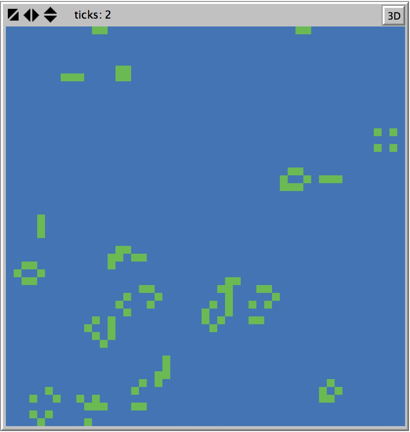
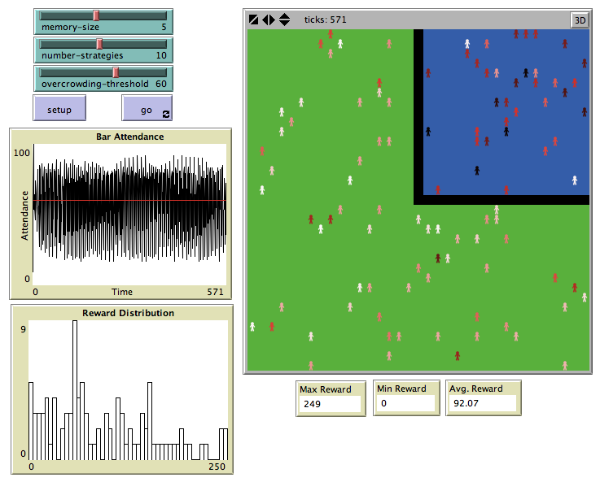
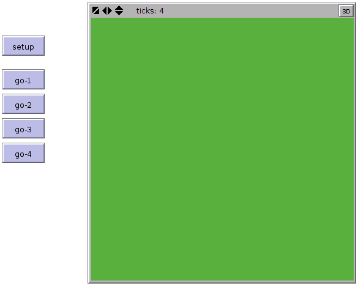
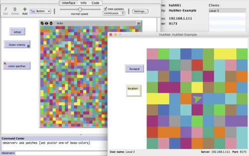
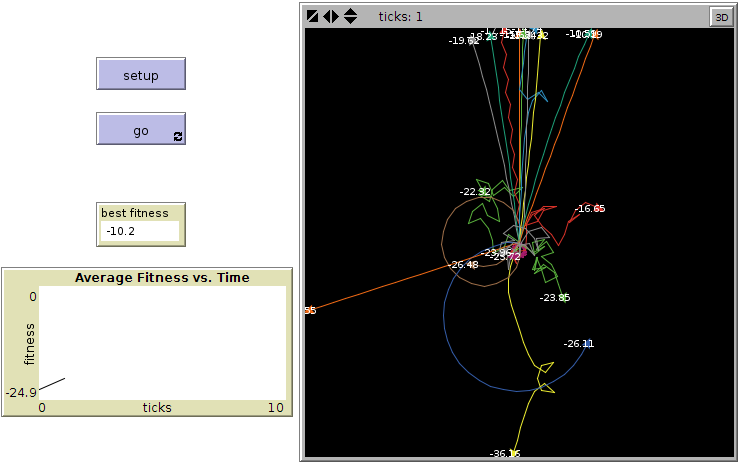
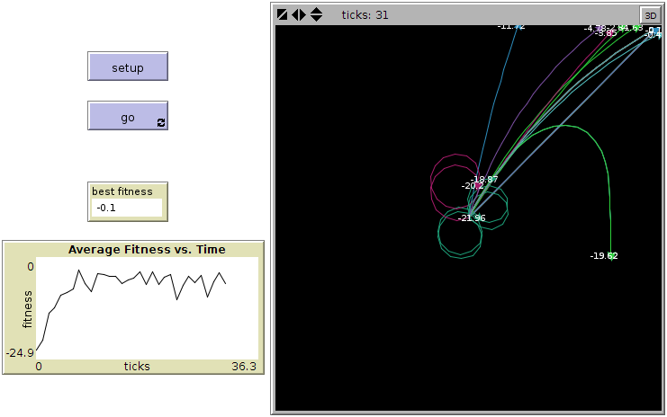

# Updates to the Book
Since the book was published, a number of revisions and updates to the book's text have been made.
The latest version of the text (and updated models when applicable) is listed below.

Updates are divided into printing.
To figure out which printing you have, flip the copyright page in the beginning of the book.
At the bottom, there should be a sequence of decreasing numbers.
The smallest number is printing of your copy.
Errors in later printings should be assumed to be present in earlier printings as well.

## Fourth printing
### Chapter 5

- On page 210, there code says “slow-down-car" with no inputs, should have the input car-ahead
- On page 216, the following code and text appears:

> ```
foreach a-list [
    ask ? [ ] ;; do stuff here
]
```

> The “?” is a special variable that takes on the value of each element of the list. So this code will iterate through each turtle in the list, and ask each in that particular order, to do what we specify in the brackets. We will further discuss the “?” variable later in this chapter.

This uses the NetLogo 5 task syntax. It should use the NetLogo 6 anonymous procedure syntax and have the following explanation:

> ```
foreach a-list [ [agent] ->
    ask agent [ ] ;; do stuff here
]
```

> The `->` symbol allows you to create local variables that a primitive can then use to pass values to the block of code that comes after it.  In this case, `agent` has been created so that `foreach` can pass the values of `a-list` in one at a time.  So this code will iterate through each turtle in the list, and ask each in that particular order, to do what we specify in the brackets.  We will further discuss variables created with the `->` syntax later in this chapter.


- On page 255, the last few lines of the Grand Canyon code example read:

> ```
  (foreach sort patches patch-elevations [
    ask ?1 [ set elevation ?2 ]
  ])
```

This uses the NetLogo 5 task syntax. It should use the NetLogo 6 anonymous procedure syntax:

> ```
  (foreach sort patches patch-elevations [ [the-patch the-elevation] ->
    ask the-patch [ set elevation the-elevation ]
  ])
```

- Box 5.7 on page 256 describes the special variables used with the old NetLogo 5 task syntax.
The box should be updated as follows in accordance with the new NetLogo 6 anonymous procedure syntax:

> The Grand Canyon model code makes use of primitives that pass values into a block of code using a special variable creation syntax: `[ [ a b ] -> ... ]`.  Here, `a` and `b` are local variables that a procedure can pass values into before running the code in the block.  For example, in `foreach`, these variables are set to different values every time the `foreach` primitive goes through its loop, as shown below:

> ```
  (foreach sort patches patch-elevations [ [the-patch the-elevation] ->
    ask the-patch [ set elevation the-elevation ]
  ])
```

> For each iteration, `the-patch` will be set to the next patch as sorted.  The `sort` primitive sorts the patches such that the first item is in the upper left corner and then lists them left-to-right and top-to-bottom, with `the-elevation` set to the next item in the `patch-elevations` list.  Another example of these local variables is evidenced in the `sort-by` primitives, which takes a comparator reporter and a list and returns a sorted list. Consider two examples:

> ```
sort-by [[x y] -> x < y] [8 5 4 7 2 1]
sort-by [[x y] -> x > y] [8 5 4 7 2 1]
```

> In both cases, `x` is always the first item being compared and `y` is the second item being compared.  The result of the first `sort-by` is `[1 2 4 5 7 8]`, whereas the second `sort-by` reports `[8 7 5 4 2 1]`.

## Second printing

### Chapter 1


- On page 22, the book begins an exploration of how ants forage for food. Throughout the section, the text refers to NetLogo's Ants model. The book should instead refer to the Ants Simple model that is included in the IABM Textbook folder of the Models Library.

- The last sentence of chapter 1 on page 40 reads:

> It will be necessary to work though the tutorials to do many of the explorations at the end of this chapter and to follow chapter 2.

- it should read:

> It will be necessary to work through the tutorials to do many of the explorations at the end of this chapter and to follow chapter 2.

### Chapter 3

- On page 129, the first paragraph includes the sentence:

> In his investigations into the nature of nature of segregation

in which the words "nature of" are incorrectly duplicated.


-   The third paragraph on page 137 include the sentence:

    > If you play with the model enough, you will notice that the PERCENT
    > SIMILAR monitor ends up with a lower value at the end of the run then
    > it did after the first extension.

    it should read:

    > If you play with the model enough, you will notice that the PERCENT
    > SIMILAR monitor ends up with a lower value at the end of the run than
    > it did after the first extension.


-   The last sentence on page 147 should read:

    > Thus, we must enter the following under “Plot update commands.”


-   The IABM Textbook folder of the NetLogo 5.2 models library contains slightly older versions of the Fire extensions models. The NetLogo 5.3.1 Models Library contains the most up to date versions.

### Chapter 4

-   On page 247, the first sentence of the second full paragraph
    duplicates the word that.

-   On page 253, there is a URL provided to download the Flocking 3D
    Alternate model. That URL does not work as the NetLogo 3D models are
    not currently hosted online.

### Chapter 8
-   The Run Example model initially included in the Models Library did not use ticks. An corrected version of the model that is tick-based is available on the Models page of this site and can be downloaded <a href="models/Run Example.nlogo" class="model-download-link">here</a>.

-   Pages 379-383 describe communication from NetLogo to the Arduino board. The Arduino Example model included in NetLogo 6.0 also illustrates how NetLogo can read data from the Arduino.

-   On page 418, the second last sentence of the first paragraph in the
speed section should read:

    > As the core NetLogo engine is single threaded, you cannot run a single
    > model on multiple processors (cores).


## First printing

### Preface

- Page xvi refers to the "IABM" folder of the models library. It should be the "IABM Textbook" folder.

### Chapter 1
- On the first page of Chapter 1, the quote *Some look at things that are, and ask why? I dream of things that never were and ask why not?* is attributed to John F. Kennedy. The attribution for the quote should more accurately read: John F. Kennedy, paraphrasing George Bernard Shaw.

### Chapter 2

- On page 46, the caption for Figure 2.1 should read:

> (A) an isolated live cell (marked with a star)          B) After Life rule 1 is invoked, the cell dies.

- Figure 2.12 does not include the grey bar at the top of the view as the text suggests. Below is an updated Figure 2.12 image.



- The footnote on page 60 refers to the "IABM Models" folder of the models library. It should be the "IABM Textbook" folder.

- On page 73, the text reads:

> Now that we have verified that our SETUP procedure seems to be working well, we are ready for our GO procedure.

After "well" there should be the following footnote:

> There is in fact a subtle bug in the SETUP procedure. Finding it is an exercise for the reader. See exploration 13.

- On page 79, in box 2.8, the text refers to the PERSONALITIES slider it should say chooser.

- In page 79, the following is stated:

> the ACT-BRAVELY code points the turtle toward the midpoint between the friend and enemy, while the ACT-COWARDLY code points the turtle toward a point that is as far away from its FRIEND as the FRIEND is from the ENEMY. (See figures 2.32 and 2.33.)

The first statement regarding a brave agent is correct. However, a more accurate description of a coward agent should be "the ACT-COWARDLY code points the turtle toward a point that is *half* as far from its FRIEND as the FRIEND is from the ENEMY". In other words, according to the code and figure, the coward would like to hide and stay "close" to its friend.

The code for the heroes and cowards model is deliberately not quite correct. In exploration 13, we ask readers to find and fix the bug. Here is a link to a corrected version of the model: <a href='othermodels/Heroes and Cowards (exploration 13).nlogo' class="model-download-link">Heroes and Cowards (exploration 13)</a>

- Page 87 reads:

> In fact, several of the models that we have already discussed, such as Ants, the Game of Life and Heroes, and Cowards have been applied to understanding social systems.

It should say:

> In fact, several of the models that we have already discussed, such as Ants, the Game of Life, and Heroes and Cowards have been applied to understanding social systems.

- On page 92, in Box 2.11, the sentence:

> Unlike agentsets, lists can have duplicate members, so for example, one could have a list of turtle agents such as [(turtle 0) (turtle 5) (turtle 0) (turtle 3) (turtle 5)].

should be added at the end of the paragraph that starts

> Lists are ordered collections of data...

### Chapter 3

-   On page 104, the sentence that reads:

    > A fire moving through a forest can be thought of as a kind of percolation where the fire is like the oil and the forest is like the rock, with the empty places in the forest analogous to the porosity of the rock.

    should read:

     > A fire moving through a forest can be thought of as a kind of percolation where the fire is like the oil, the trees are like the spaces between the rock, and the empty places in the forest cannot percolate the fire, analogous to the rock.

-   In the last paragraph on page 109, the 2 in the sentence:

    > However, if we raise the density to 61 percent, just 2 percent more density...

    should be a 4.

- Page 110 refers to the "IABM" folder of the models library. It should be the "IABM Textbook" folder.

- Page 114 contains the following code: `if all? patches [pcolor = red]`. It should actually be: `if all? patches [pcolor != red]`.

- On page 125, the `reset-ticks` command is missing at the end of the `setup` procedure.

-   On page 130, in the caption for Figure 3.15, the credit to Rankin, 2009 was omitted. It should say:

    > From Bill Rankin, 2009 (Yale University); [www.radicalcartography.net](www.radicalcartography.net).

    Also, the text of the caption should say:

    > A map of Chicago with each dot representing twenty-five people. By representing the data at this finer level of resolution, we see nuances of segregation (e.g., smaller segregated neighborhoods are visible that would disappear at a coarser resolution) much like ABM enables us to explore nuances of individual-level behavior.

-   The first line on page 133 should read:

    > The code asks a random set of patches to each sprout a turtle.

-   The first paragraph of page 134 reads:

    > One simple extension to this model is to add a third, fourth, and even
    > fifth ethnicity. This can be done by modifying the SETUP code.
    > Currently the model sets all the turtles to red initially, then asks
    > half of them to become green. Recall the code that sets up the
    > turtles:

    It should read:

    > One simple extension to this model is to add a third, fourth, and even
    > fifth ethnicity. This can be done by modifying the SETUP code.
    > Currently the model sets all the turtles to random colors initially,
    > then asks each of them to randomly choose to be colored red or green.
    > Recall the code that sets up the turtles:

-   On page 145, the text reads:

    > In this case, the darkest agents will be the one with the lowest
    > reward, and the lightest agents will be the ones with the most reward
    > (see figure 3.23).

    it should read:

    > In this case, the lightest agents will be the ones with the lowest
    > reward, and the darkest agents will be the ones with the most reward
    > (see figure 3.23).

-   At the bottom of page 148 and the top of 149, the following text appears:

    > As you run the model over time, you will see it start out similar to a
    > normal distribution, but the distribution will quickly change with a
    > few groups of individuals maintaining large rewards and many more
    > having a lower reward. This lends credence to the hypothesis that
    > there are a few agents that achieve a high reward level, but then
    > there is a large gap between these high achieving agents, and the
    > majority of agents, which achieve more average reward levels. (See
    > figure 3.26.)

    It should be:

    > As you run the model over time, you will see it start out similar to a
    > normal distribution, but the distribution will quickly change with a
    > few groups of individuals maintaining large rewards and many more
    > having a lower reward (similar to our discussion in the simple economy
    > model). This provides some evidence for answering the question we
    > asked at the beginning of this section with regards to whether there
    > is a gap between these high achieving agents, and the majority of
    > agents. (See figure 3.26.)

-   On page 149, Figure 3.26 should be replaced by the following image:

    

-   On page 149, the following text appears:

    > In the second extension, we provided numerical output of the minimum,
    > maximum and average reward values of the agent via monitors. Finally,
    > in the third extension we created a histogram of that data which gives
    > us a richer understanding of the underlying distribution if rewards
    > per agent

    It should be:

    > In the second extension, we provided numerical output of the minimum,
    > maximum and average reward values of the agents via monitors. Finally,
    > in the third extension we created a histogram of that data, which
    > gives us a richer understanding of the underlying distribution of
    > rewards per agent

-   Pages 152 and 154, explorations 3, 7, and 22 through 25 refer to the "Segregation model". They should instead refer to the "Segregation Simple model" found in the models library at IABM Textbook &gt; chapter 3 &gt; Segregation Extensions.

-   Page 153, exploration 12 refers to the extensions of the "Fire model". It should instead refer to the extensions of the "Fire Simple model" found in the models library at IABM Textbook &gt; chapter 3 &gt; Fire Extensions.

-   On page 173, in the middle of the page, there should be a line break between the wiggle procedure and the move procedure.

    On page 176, the procedure at the end of the page reads:

    ```
    to setup
      fd 1
      set energy energy - 1
    end
    ```

    It should say:

    ```
    to move
      fd 1
      set energy energy - 1
    end
    ```

### Chapter 4

-   On page 194, the sentence:

    > ...which means that there is always a positive probability that the population will rebound.

    should read:

    > ...which means that even when the population dips very low, it will always rebound.


### Chapter 5

-   In the last paragraph on page 204, the text should read:

    > ...causing the traffic jam to move backward even as the traffic moves forward.

    as opposed to

    > ...causing the traffic jam to move backward even as the traffic jam moves forward

-   On page 208, after the sentence:

    > The SPEED-LIMIT and SPEED-MIN are set to constant values, which means that all of the cars in this model will have the same SPEED-LIMIT and SPEED-MIN.

    we have added:

    > Since they are the same for every car, these variables could have been defined as globals rather than turtle variables. We have specified them as turtle variables since modifications or extensions to this model might well have every car with its own speed-limit values.

-   In the last paragraph on page 211, when we refer to the grass variable in the text, we mean to refer to the GRASS-AMOUNT variable.
-   On page 218, there is code that says `forward10` (no space between the word and number). It should say `forward 10`.
-   On page 218, the text below appears:

    > This can be confusing when first thinking about agentsets, but really, this is a variant of the same issue you run into whenever you take action based on the condition of a variable and that action affects the value of the same variable.

    Below is the corrected text:

    > This can be confusing when first thinking about agentsets, but really, this is a variant of the same issue you run into whenever you take action based on the value of a variable and that action affects the value of the same variable.

-   On page 219-222, the book goes through the agentset efficiency model. Since time of publication, we have created an improved version of that model. The improved model is in the IABM Textbook folder of the models library (and also in the NetLogo models tab of this website). [The model on this website](models/Agentset Efficiency.nlogo) should be considered definitive, and not the code in the textbook.
-   On page 219, we have clarified the sentence:

    > This code computes each of the two agentsets PATCHES WITH \[PCOLOR = RED\] and PATCHES WITH \[PCOLOR = GREEN\] twice.

    to read:

    > This code computes each of the two agentsets (patches with \[ pcolor = red \] and patches with \[ pcolor = green \]) once in the ask and then once for each patch, since the agentsets are constructed in the bodies of the ask blocks. That is, each agentset is computed one plus the number of patches times!

-   On page 220, where we say:

    > Instead, this code will result in a picture like figure 5.5, where all the patches are red.

    The patches we are referring to are green. Also, in the last paragraph, the line:

    > The first “if statement” turns the patches green.

    should read:

    > The first ask statement turns the patches green.

-   On page 221, the text:

    > ...second “if statement” is executed, all the patches are green and therefore then turn red. By computing the agentsets ahead of time, as in GO-4, you are not only using more efficient code but are also ensuring that the green-patches agentsets you ask to execute the instructions are the same green-patches agentsets as at the start of the procedure and not the set of green patches that result from the first “if-statement,” resulting in the expected picture of figure 5.4.

    has been updated to:

    > second ask statement is executed, so all the patches are green, and therefore do nothing! By computing the agentsets ahead of time, as in GO-4, we are not only using more efficient code but are also ensuring that the count of patches that were red stays the same throughout the procedure, resulting in the expected picture in figure 5.4.

-   On page 222, Figures 5.5 should be replaced by the following image:

    

-   On page 226, where it reads:

    > While this second implementation of the car agent’s cognition is more sophisticated than our initial design, it is still built on an underlying assumption that can be further refined.

    It should read:

    > While this second implementation of the car agent’s cognition is not really more sophisticated than our initial design, it is still built on an underlying assumption that can be further refined.

-   On page 228, the following text appears: "To implement the goal-based version of the model". It should be expanded as follow:

    > To implement the goal-based version of the model (the traffic-grid-goal model found in the chapter 5 subfolder of the IABM TEXTBOOK folder of the NetLogo models library),

-   On page 231, the text in the first paragraph should refer to TICKS-BETWEEN-EXPLORATION, not TICKS-BETWEEN-TESTS
-   Page 246 describes the Preferential Attachment Simple model. This model has been updated with an improved visualization. [The model on this website](models/Preferential Attachment Simple.nlogo) is up to date.
-   On page 261, the following text appears:

    > The Ants model demonstrates this kind of interaction when the ants examine the environment to look for food and sense pheromone:

    It should be expanded as follows:

    > The Ants model (which we saw in chapter one, and is in the biology section of the NetLogo models library) demonstrates this kind of interaction when the ants examine the environment to look for food and sense pheromone:

-   On page 263, there is a space missing in the line of code that reads: `create-turtles 100 [setxy random-xcor random-ycor]`
-   Page 277 refers to the "IABM" folder of the models library. It should be the "IABM Textbook" folder.
-   In question 8 on page 277, there is missing ? on the 3rd last line. It should read:

    > What are the results of your model? What happens when the new nodes use only degree to make their decision?


### Chapter 6

-   On page 284, the text reads:

    > It is impossible for the remaining 125 people to each infect five new people, and thus the number of infected people will tail off because there is no one left to infect.

    it should read:

    > It is impossible for all 156 infected people to each infect five new people because there are only 44 uninfected people remaining, and thus the graph of the number of infected people will flatten out because there are few people left to infect.

-   The last paragraph on page 291 incorrectly refers to the full data set in table 6.3. It should refer to the data set in table 6.5
-   On page 306, the last paragraph reads:

    > This could indicate whether that individual practices hygiene habits or participates in infectious behavior.

    it should read:

    > This could reflect varying strengths in individuals' immune systems or how well they take care of themselves once they get sick.


### Chapter 8

-   On page 360, the following text appears:

    > For instance, in the Disease model described in the preceding box

    It should say:

    > For instance, in the Disease HubNet model described above

-   The caption on Figure 8.2 on page 261 should read:

    > HubNet Disease Activity (Wilensky & Stroup, 1999b). The NetLogo model on the top is the HubNet server, and there are two clients beneath it.

-   Figure 8.6 of the HubNet model is misleading. This one is clearer:

    

-   On page 375, the textbook is assuming you are using the latest version of the GoGo Board hardware, which uses an HID (Human Interface Device) interface. If you have an older version of the board that uses the serial interface, then load the gogo-serial extension.
-   At the bottom of page 375, the text reads:

    > Open the monitors to see how the GoGo extension allows access to the current readings on the dedicated sensor ports. For instance, the reporter:
    >
    >
    >             gogo:sensor 8
    >
    >
    > reports the...

    It should read:

    > Inspect the code for the monitor to see the gogo extension code inside it that allows access to the current readings on the dedicated sensor ports. For instance in the "sensor 8" monitor, there is the code `gogo:sensor 8`, a reporter that reports the...

-   The text in the last paragraph on page 395 the sentence:

    > In this example, our fitness function could be as simple as the straight-line distance from the turtle to the target patch after twenty ticks.

    should say the model runs for twenty-five ticks.
-   On page 399, Figures 8.19 A and B should be replaced by the following images:

    <br/><br/>

    

-   On page 400, the code for the setup procedure of the Sandpile Simple model is shown as follows:

          to setup [setup-task]
            clear-all
            ask patches [
              ;; n is set to the result of running the initial-task (which is an input to the
              ;; set procedure)
              set n runresult setup-task
              recolor
            ]
            set total sum [n] of patches
            reset-ticks
          end


    It is missing one line. It should actually be:

          to setup [setup-task]
            clear-all
            ask patches [
              ;; n is set to the result of running the initial-task (which is an input to the
              ;; set procedure)
              set n runresult setup-task
              recolor
            ]
            set total sum [n] of patches
            ;; set this to the empty list so we can add items to it later
            set sizes []
            reset-ticks
          end


-   The attributes list in the middle of page 408 should be:

    1  4  0.8
    2  3  1.0
    2  5  3
    2  7  2.5
    2  8  1.3
    2  10 2.2
    3  9  2.3
    5  6  2.8
    6  5  1.2
    6  9  0.3
    7  2  1.1
    8  1  2.6
    9  8  2.1
    10 7  0.9

-   On page 419, after the sentence:

    > Both “netlogo-users” and “stackoverflow” have many NetLogo experts who are usually very responsive to questions.

    we would like to add the additional information:

    > You may also want to use the Profiler extension that is bundled with NetLogo and can help identify bottlenecks in your code (see the documentation at http://ccl.northwestern.edu/netlogo/docs/profiler.html).

-   On pages 427-428, explorations 26 through 30 rely on downloading your Facebook network using a tool called Netvizz. Facebook has recently changed its policies regarding these sorts of tools and has been shutting them down in recent months. Consequently, in order to stay functional, Netvizz has had to remove its ability to download personal networks. You can read more about this on [Netvizz's announcement](http://thepoliticsofsystems.net/2015/01/the-end-of-netvizz/).

    [GetNet](http://snacourse.com/getnet/), a similar tool, is still operational, and exports in a format supported by the NetLogo network extension (GML). However, there is a good chance that it, too, will be shutdown in coming months. Using GetNet instead of Netvizz, exploration 26 should read as follows:

    > 26\. Many websites provide interfaces and APIs where you can access data sets. For example, GetNet provides an interface for obtaining your Facebook network. Using the network extension, we can load and analyze the network in NetLogo.
    >
    > If you have a Facebook account, go to [http://snacourse.com/getnet/](http://snacourse.com/getnet/) and follow the instructions for downloading your network. After completing step 2, GetNet will assemble your personal Facebook network and give you the option to download it as a GML file. Go ahead and do this. Next, open the GML file in a text editor such as Notepad (on Windows) or TextEdit (on OS X). You will see entries that look like the following:
    >
    >         node [
    >           id 1
    >           label "Jane Smith"
    >           sex "female"
    >           wallcount 52
    >         ]
    >
    > The actual node attributes will vary depending on your choices when generating the network.
    >
    > Next, create a new NetLogo model. In order for NetLogo to import the node attributes in the GML file, you must declare them as turtle variables. For the above node to be fully imported, this looks like:
    >
    >         turtles-own [ id sex wallcount ]
    >
    > Remember, LABEL is a built-in turtle variable and so does not need to be declared. Once you have done that, loading your network is just one command
    >
    >         nw:load-gml “/path/to/your/network.graphml” turtles links
    >
    > This will create a turtle for each of your friends and the links between them. Now it is time to play with your friends! Can you visualize your network better by using layout-spring? It's very likely that your network will naturally cluster into several groups. By examining the turtle labels in these groups, can you figure out what each group corresponds to? Can you figure out which of your friends are most central by using centrality measures available in the network extension? (See [the network extension's webpage](http://ccl.northwestern.edu/netlogo/docs/nw.html) for documentation.)


### Appendix

-   On page 437 the text reads:

    > Holland was also influenced early on by a group of his peers at the University of Michigan: Burks, Axelrod, Cohen, and Hamilton.

    This passage should be:

    > Holland was also influenced early on by a group of his peers at the University of Michigan: Burks, Axelrod, and Cohen. The four of them together were known by the acronym BACH.
